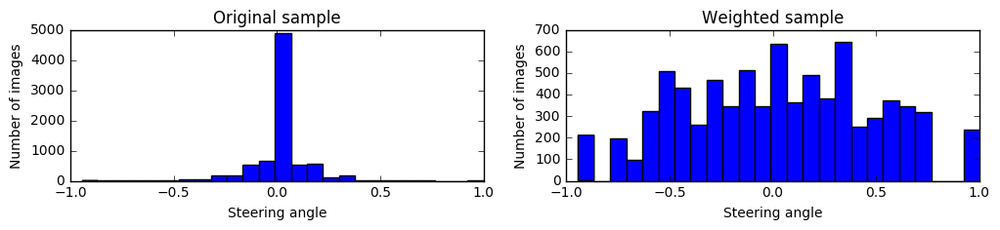

# Behavioral Cloning using Deep Learning

In this project, we use deep learning to imitate human driving in a simulator. In particular, we utilize Keras libraries to build a convolutional neural network that predicts steering angle response in the simulator. 

The project consists of following files : 

* `model.py` : The script used to create and train the model. The script includes a python generator for real-time data augmentation. 
* `drive.py` : The script to drive the car.
* `model.json` : The model architecture.
* `model.h5` : The model weights.
* `setup.py` : The script to load, prepare and assign weights to training data - required by `model.py`
* `preprocess.py` : The script for preprocessing images - required by `model.py` and `drive.py`
* `Project.ipynb` : IPython notebook with step-by-step description and execution of entire code. 

Below we give description of the project starting from data praparaion and pre-processing to model architetcture and training. Further details alongside the code can be found in `Project.ipynb`.

### Training data  

* For training purposes, we used sample data for track 1 provided by Udacity. Out of the 8036 images in the dataset, we found 3 image frames with suscpiciously large steering angles which were corrected.      


* One major issue with the training data is that car is mostly driven on straight roads. Consequently, steering angles are often close to zero making the dataset imbalanced. To remove bias towards small steering angles, images are assigned selection probabilities so as to get a more uniform steering angle distribution :  


* While reweighting dataset as above will allow us to train model for curved roads, nevertheless it is still possible for car to wander off the middle of the road even on a straight road. While we do not have sufficient training data for recovery in such situations, we can make use of left and right cameras which comes with the dataset and adjusting the steering accordingly (see section on Data Augmentation):


### Image preprocessing 

* Crop image : Starting with the original image of size 320x160, we crop the bottom 24 pixels to remove the car hood and the top 30 pixels to remove things above horizon (such as sky etc.) 
* Contrast normalization : Convert to YUV colorspace and apply histogram equilization on the Y channel for contrast enhancement (helps with day/night driving) and then convert back to RGB. All color channels are then normalized so that array values lie between -0.5 and 0.5
* Resize image : All images are resized to 200x66 pixels. The initial layers of our CNN will be similar to NVIDIA architecture which happens to use 66x200x3 dimensional input tensor.

Here is the preprocessing pipeline in action on track 1:


Here is the preprocessing pipeline in action on track 2 (note : we do not we use this track for training) : 


### Data augmentation

* Camera selection : As already mentioned, to augment our dataset, we use different camera positions to simulate car moving off the middle of the road.  

* Viewpoint transformation : We use two kinds of viewpoint transformations :
 * Lateral shift : This perspective transformation keeps the horizon fixed while shifting the car laterally (this is the same as view from left/right cameras for fixed values of shift) . 
 * Rotation : This keeps the position of the car on the road fixed while moving the horizon.  

 Below we show the two viewpoint transformations in action :
 
 
 Although these transformations introduce distortions above the horizon, they do not affect the training. 
 
 Below we demonstrate how the different camera angles are equivalent to shift viewpoint transformations :
 
 
* Flip : Images are flipped about vertical axis to remove bias in the steering angles towards a particular side.

Below we show the three data augmentation procedures in action : 


For data augmentation procedure to work, it is of course essential that steering angles are adjusted accordingly. For flip, this is easily accomplished by changing the sign of steering angle. However, for camera angle and more generally for viewpoint transformations, this requires some kind of ad-hoc calibration. For lateral shifts (horizon kept fixed), a change of 0.1 in steering angle causes a shift of 18 pixels at the bottom of the image. For rotations (bottom of the image kept fixed), a change of 0.1 in steering angle causes a shift of 18 pixels at the horizon. Changing the camera positions from center to left/right is equivalent to later shift of about 70 pixels. Below random pictures with augmentation are shown along with the adjusted steering angles :


### Neural network architecture 

We use a convolutional neural network (CNN) with architecture similar to the one implemented by NVIDIA (https://arxiv.org/abs/1604.07316). The input tensor size for CNN is 66x200x3 and the architecture for convolutional (conv) layers is identical to NVIDIA architecture. We use 24,36 and 48 5x5 filters for the first three conv layers with strides of 2x2. The next two conv layers use 64 filters of size 3x3 with single strides. This is our base model upon which we build our final architecture. 

For this project, it suffices to use a single fully-connected (FC) layer with 250 neurons before the final output layer (a single nueron which outputs the steering angle prediction). ReLU activations are used after each layer except the final output layer.   


```
____________________________________________________________________________________________________
Layer (type)                     Output Shape          Param #     Connected to                     
====================================================================================================
convolution2d_1 (Convolution2D)  (None, 31, 98, 24)    1824        convolution2d_input_1[0][0]      
____________________________________________________________________________________________________
convolution2d_2 (Convolution2D)  (None, 14, 47, 36)    21636       convolution2d_1[0][0]            
____________________________________________________________________________________________________
convolution2d_3 (Convolution2D)  (None, 5, 22, 48)     43248       convolution2d_2[0][0]            
____________________________________________________________________________________________________
convolution2d_4 (Convolution2D)  (None, 3, 20, 64)     27712       convolution2d_3[0][0]            
____________________________________________________________________________________________________
convolution2d_5 (Convolution2D)  (None, 1, 18, 64)     36928       convolution2d_4[0][0]            
____________________________________________________________________________________________________
flatten_1 (Flatten)              (None, 1152)          0           convolution2d_5[0][0]            
____________________________________________________________________________________________________
dense_1 (Dense)                  (None, 250)           288250      flatten_1[0][0]                  
____________________________________________________________________________________________________
dense_2 (Dense)                  (None, 1)             251         dense_1[0][0]                    
====================================================================================================
Total params: 419,849
Trainable params: 419,849
Non-trainable params: 0
____________________________________________________________________________________________________

```


Several attempts were made to add dropout layers after conv layers and/or FC layer for regularization but it did not seem to help much. In the end, we decided to not use dropout at all. 

### Training and validation
Initially, we started by splitting data from track 1 into training and validation sets. An explicit test data was not used, instead performance of the model was judged by driving in the autonomous mode on tracks 1 and 2. 
We used batch size of 64 and 8000 augmented images per epoch were used for training. Due to memory limitations, images and augmented images have to generated in real time. For this purpose, a custom python generator was used which can be passed to Keras during training. We used mean squared error as the loss measure and Adam optimizer for the learning rate. As already stated, dropout layers did not seem to help with the overfitting. Interestingly, we found that the easiest way to avoid overfitting was early stopping. In particular, stopping the training after 3 epochs allows the car to run smoothly in the autonomous mode. This was also reflected in the validation loss which started increasing after 3 epochs. 

It should be pointed out that data used for validation is not a good indicator for tuning the model for new tracks because the images in training and validation sets are highly correlated as they belong to the same track. Given that we use only track 1 for data, we find that there is no good way to split data into training and validation sets. In the end, after having determined the optimal number of epochs, we used all data for training.

### Testing

Here is track 1 autonomous driving :

[](http://www.youtube.com/watch?v=nkiMnoYKWz0 "Track 1")

Here is track 2 autonomous driving (set ```throttle=0.5``` in `drive.py` to prevent the car from sliding back):

[](http://www.youtube.com/watch?v=ptdOo9lOyg4 "Track 2")

